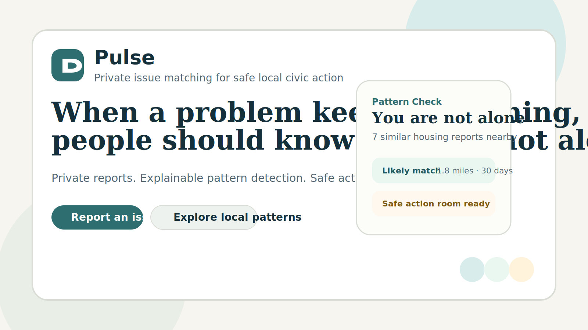
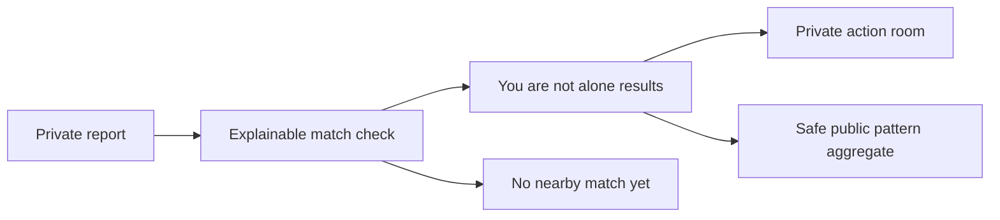

<p align="center">
  
</p>

<h1 align="center">Pulse</h1>

<p align="center">
  <strong>Private issue matching for local civic action.</strong>
</p>

<p align="center">
  Pulse helps people privately report recurring local problems, detect whether they are part of a real pattern, and coordinate safely in a private action room.
</p>

<p align="center">
  <a href="https://pulse-civic-mvp.vercel.app"><strong>Live demo</strong></a>
  ·
  <a href="https://codespaces.new/ymbawa26/pulse-civic-mvp"><strong>Open in Codespaces</strong></a>
</p>

<p align="center">
  
  
  
  
  
</p>

## Why This Is Different

Most civic platforms push people toward public outrage.

Pulse is built around a quieter promise:

> When a problem keeps happening, people should know they are not alone.

That means:

- no public feed
- no likes, reposts, or popularity mechanics
- no public accusations against private people
- no exact-address exposure
- no vague black-box AI claims

Instead, Pulse focuses on explainable pattern visibility, evidence, and safe lawful coordination.

## Core Flow



## What You Can Try Right Now

- privately submit a housing, campus, safety, or service issue
- see whether it matches similar nearby reports
- join a private room if a safe cluster exists
- explore privacy-preserving public pattern summaries
- sign in as a moderator and review flagged reports

## Feature Highlights

- private issue reporting with category, approximate location, privacy mode, severity, and optional evidence upload
- explainable matching based on category, distance, keyword overlap, time window, and a small transparent neural similarity signal
- match confidence labels: `Strong match`, `Likely match`, `Weak match`
- score breakdowns for `Distance`, `Keywords`, `Timing`, and `Semantic signal`
- public pattern explorer that shows approximate local clusters only
- private action rooms with discussion, shared evidence checklist, and voting on lawful next steps
- safety filters for threats, harassment prompts, phone numbers, and exact-address style content
- built-in demo data for housing neglect, campus accessibility issues, and neighborhood safety concerns

## Tech Stack

- Next.js App Router
- TypeScript
- Tailwind CSS
- Zod
- Vitest
- Playwright
- Supabase-ready schema and environment structure
- local demo persistence layer for fully working out-of-the-box flows

## Try It Locally

```bash
npm install
npm run seed:demo
npm run dev
```

Then visit `http://127.0.0.1:3000`.

## Try It On Another Computer

The easiest GitHub-native path is Codespaces:

1. Click `Open in Codespaces` above.
2. Wait for the workspace to start.
3. Run `npm install`.
4. Run `npm run seed:demo`.
5. Run `npm run dev` and open the forwarded port.

## Demo Accounts

- Resident: `sam@pulse.local` / `PulseDemo123!`
- Resident: `jade@pulse.local` / `PulseDemo123!`
- Moderator: `moderator@pulse.local` / `PulseAdmin123!`

## Scripts

- `npm run dev`
- `npm run build`
- `npm run start`
- `npm run seed:demo`
- `npm run lint`
- `npm run typecheck`
- `npm run test:unit`
- `npm run test:integration`
- `npm run test:e2e`
- `npm run verify`

## Current Status

This repo is a working, tested MVP with a public hosted demo and a strong local demo path.

What is complete:

- working end-to-end app in `demo` mode
- seeded local data
- unit, integration, and E2E test coverage
- Supabase SQL schema and seed files for migration planning

What is still intentionally unfinished:

- the live Supabase repository implementation behind `NEXT_PUBLIC_APP_MODE=supabase`

## Project Structure

- `src/app` app routes and pages
- `src/components` UI, layouts, and forms
- `src/lib/actions` server actions
- `src/lib/data` repository, seed logic, and local demo storage
- `src/lib/matching.ts` explainable matching engine
- `src/lib/moderation.ts` safety checks
- `src/tests` unit, integration, and E2E suites
- `supabase/migrations` SQL schema
- `docs/PRODUCT_RATIONALE.md` architecture notes
- `docs/VERIFICATION_REPORT.md` verification summary

## Verification Snapshot

Verified locally with:

```bash
npm run seed:demo
npm run lint
npm run typecheck
npm run build
npm run test:unit
npm run test:integration
npm run test:e2e
```
